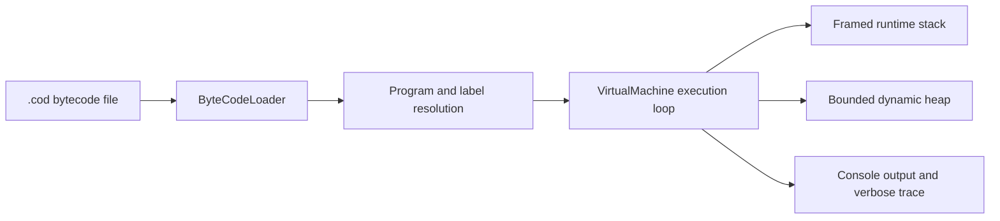

# Stack Machine Interpreter

A Java virtual machine that loads and executes textual bytecode for the educational **X language**. The interpreter combines label resolution, framed runtime stacks, recursive function calls, dynamic heap allocation, console I/O, and instruction-level tracing in a compact implementation built entirely with the Java standard library.

## Features

- Loads `.cod` bytecode programs and maps opcodes to instruction classes
- Resolves symbolic labels for calls, branches, and jumps before execution
- Maintains isolated stack frames for arguments, local values, and return values
- Supports recursion, arithmetic, comparisons, branching, and console I/O
- Provides a bounded 2 MiB heap with allocation and deallocation
- Detects invalid heap addresses, out-of-bounds access, use-after-free, and out-of-memory conditions
- Produces instruction and runtime-stack traces with `VERBOSE ON`

## Quick start

### Prerequisites

- JDK 17 or newer
- A POSIX-compatible shell for the commands below

### Build

```bash
git clone https://github.com/build4me2/Stack-Machine-Interpreter.git
cd Stack-Machine-Interpreter
mkdir -p build
find interpreter -name '*.java' -print0 | xargs -0 javac -d build
```

### Run

Pass a compiled X bytecode file to the interpreter:

```bash
java -cp build interpreter.Interpreter heapSumArray.x.cod
```

Expected output:

```text
150
```

Programs containing a `READ` instruction prompt for integer input. For example:

```bash
java -cp build interpreter.Interpreter fib.x.cod
```

Entering `8` produces `21`.

## How it works



1. `ByteCodeLoader` parses each non-empty source line.
2. `CodeTable` maps the opcode to its Java instruction class.
3. The loader creates and initializes instructions through reflection.
4. `Program` resolves symbolic labels to instruction addresses.
5. `VirtualMachine` executes instructions while managing the program counter, return addresses, runtime stack, and heap.

## Supported instructions

| Category | Instructions | Purpose |
| --- | --- | --- |
| Stack and data | `LIT`, `LOAD`, `STORE`, `POP` | Create and move values within the current frame |
| Arithmetic and logic | `BOP` | Perform arithmetic, comparison, and logical operations |
| Functions | `ARGS`, `CALL`, `RETURN` | Create frames, invoke functions, and return values |
| Control flow | `LABEL`, `GOTO`, `FALSEBRANCH`, `HALT` | Resolve labels and control execution |
| Heap | `NEW`, `HLOAD`, `HSTORE`, `FREE` | Allocate, access, update, and release dynamic memory |
| I/O and tracing | `READ`, `WRITE`, `VERBOSE` | Interact with the console and inspect execution |

## Project structure

```text
interpreter/
├── Interpreter.java              # Command-line entrypoint
├── bytecodes/                    # Instruction implementations
├── loaders/                      # Parsing, opcode mapping, and label resolution
└── virtualmachine/               # VM, runtime stack, heap, and runtime errors

*.x.cod                           # Example bytecode programs
*.x                               # Corresponding X-language source examples
```

## Example programs

| Program | Demonstrates |
| --- | --- |
| `factorial.x.cod` | Input, recursion, function frames, and verbose tracing |
| `fib.x.cod` | Recursive Fibonacci evaluation |
| `heapSumArray.x.cod` | Heap allocation, storage, loading, and release |
| `heapPrintArray.x.cod` | Heap-backed arrays and console I/O |
| `functionArgsTest.cod` | Function calls with different argument counts |

To enable tracing in a bytecode program, add `VERBOSE ON`; use `VERBOSE OFF` to stop it. While tracing is active, the interpreter prints each executed instruction followed by the runtime stack grouped into frames.

## Design notes

- Opcodes are decoupled from implementations through `CodeTable`, making the instruction set straightforward to extend.
- Control-flow instructions implement address resolution so labels are translated once before execution.
- Stack positions are frame-relative, preventing functions from directly addressing another frame's values.
- Heap address `0` is intentionally invalid, and freed addresses remain recorded to distinguish stale references from addresses that were never allocated.
- The project has no external runtime dependencies.

## License

This project is available under the [MIT License](LICENSE).
